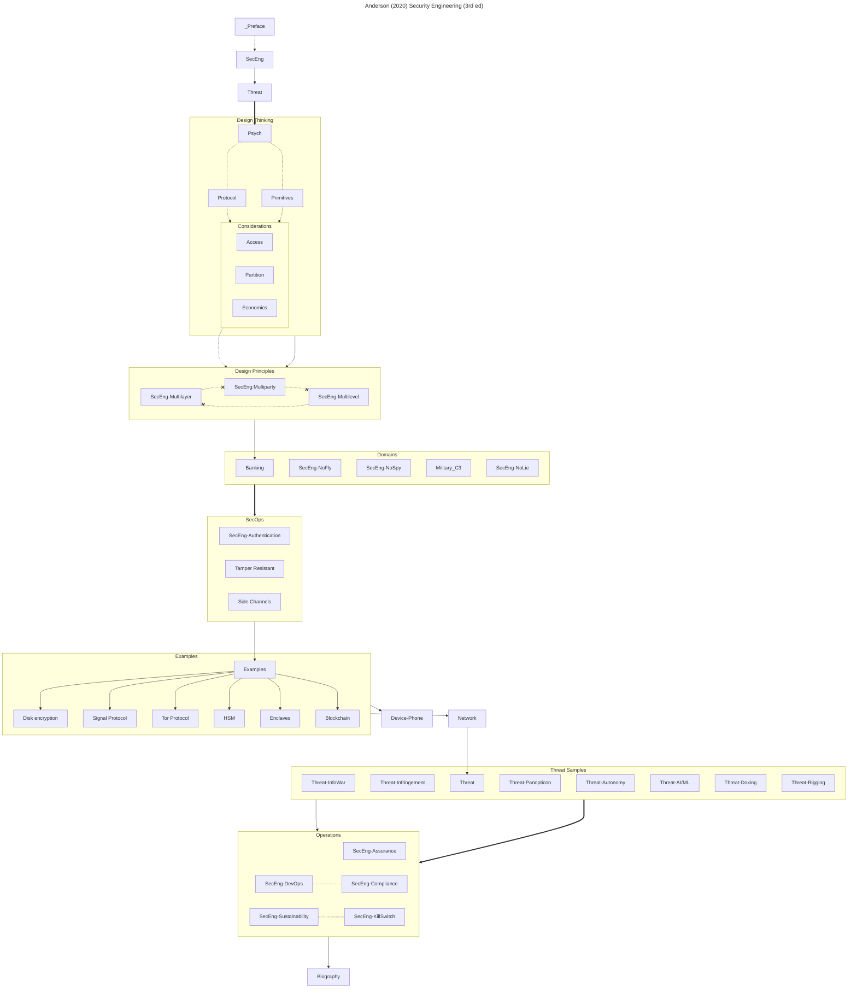

Anderson R., _Security Engineering_ [ISBN 978-1119642787
](https://www.cl.cam.ac.uk/archive/rja14/Papers/SEv3.pdf)

Lessig L., _Code 2.0_ [ISBN 978-0465039142](https://upload.wikimedia.org/wikipedia/commons/f/fd/Code_v2.pdf)
