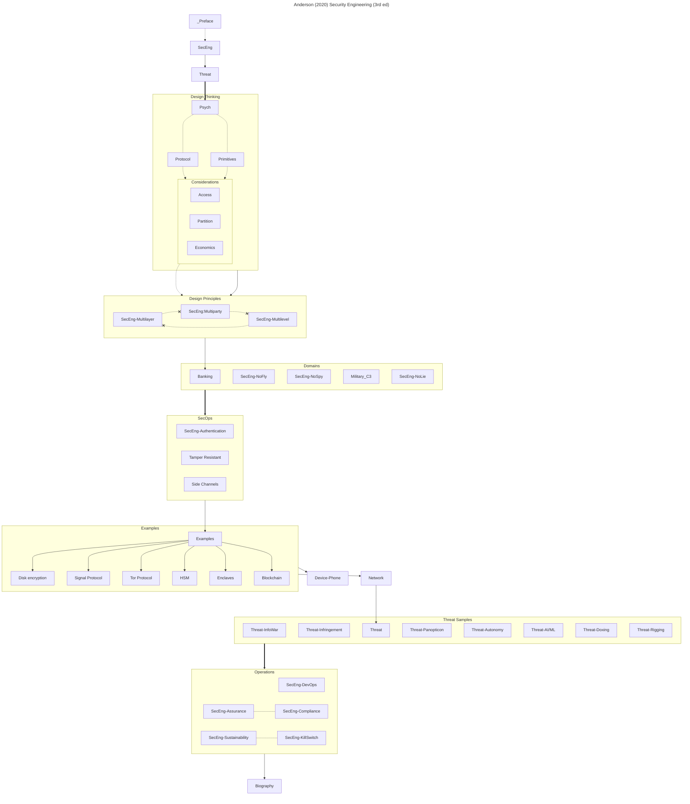
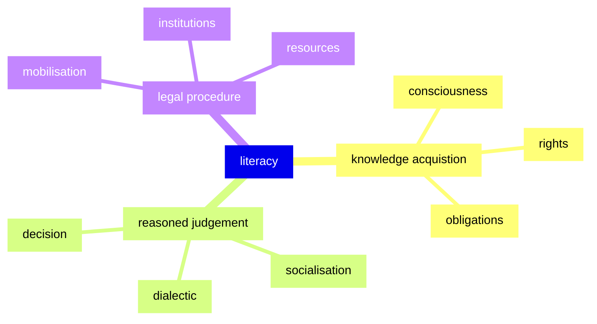

Anderson R., _Security Engineering_ [ISBN 978-1119642787
](https://www.cl.cam.ac.uk/archive/rja14/Papers/SEv3.pdf)

Lessig L., _Code 2.0_ [ISBN 978-0465039142](https://upload.wikimedia.org/wikipedia/commons/f/fd/Code_v2.pdf)

Leveson N.G., _Engineering for a Safer World_ [ISBN 978-0262533690](http://sunnyday.mit.edu/safer-world.pdf)

# Reference

🇺🇸 Opensource Casebook, [link](https://opensourceproperty.org/download/) 

Raymond E.S., The Jargon File, [link](http://www.catb.org/esr/jargon/html/index.html) (v4.4.7)

Systems Engineerng Book of Knowledge (v 2.12), [link](https://sebokwiki.org/wiki/Guide_to_the_Systems_Engineering_Body_of_Knowledge_(SEBoK))

Stanford Encyclopedia of Philosophy, [link](https://plato.stanford.edu/contents.html)

# Tools

cadCAD - macroeconomic modelling of tokenomics

OpenFISCA - mesoeconomic modelling of fiscal policy

machiNations - microeconomic simulation of game microtransactions

# Optional

🇨🇦 Zariskic A. (2014) _Legal Literacy_ [ISBN 978-1927356456]()

Voshmgir S., _Token Economy_ (3rd ed) [ISBN 978-9899157163](https://github.com/Token-Economy-Book)

